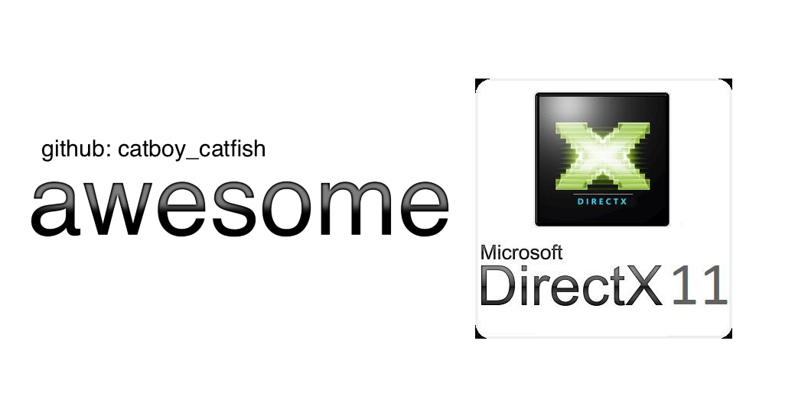

# awesome direct3D 11 learning

A curated list designed to aggregate some awesome resources on learning how to use the Direct3D 11 graphics API.
I created this list due to not being able to easily find as much information for programming with Direct3D 11 as I could for OpenGL or Vulkan.

I hope this helps you as much as it'll help me in the future.

# win32 / windowing
## articles
- [Microsoft: Module 1. Your First Windows Program](https://learn.microsoft.com/en-us/windows/win32/learnwin32/your-first-windows-program)
- [Joseph Whittington: Basic DirectX 11 tutorial, Visual Studio 2019, Win32 Window API Tutorial](https://web.archive.org/web/20231203194918/https://dev.to/josephwhittington/setup-d3d11-in-visual-studio-2019-423g) see Notes 1, 2 and 32.
## repositories
- [brainexcerpts: winAPI_basic_window](https://github.com/brainexcerpts/winAPI_basic_window)
## youtube
- [Aerideus: Creating a Window using C++ and Win32 | Tutorial](https://www.youtube.com/watch?v=Kx5CN-V6FvQ&t=0s) see Note 33.
- [PardCode: C++ OpenGL 3D Game Tutorial 1, Making the Window with the Win32 API](https://www.youtube.com/watch?v=jHcz22MDPeE&list=PLv8DnRaQOs5-TyYnF56YghOxQBNr1VVmF) see Note 44.
- [SkyVaultGames: Create a Window for your own DirectX Game Engine! | Beginner DirectX Tutorial Part 1](https://youtu.be/7MzKzR1MgNg?si=qnLGJJ4spR_LCoOP) see Notes 23 and 26.

# direct3d 11 general
## articles
- [Rodolphe Vaillant: Getting started with DirectX 11](https://rodolphe-vaillant.fr/entry/121/getting-started-with-directx-11) see Note 0.
- [About-prog: DirectX 11 Initialization, First Triangle](https://web.archive.org/web/20211127054316/https://about-prog.com/directx11/direct3d-11-init-and-triangle-rendering) see Notes 1 and 3.
- [RasterTek - DirectX 11 on Windows 10 tutorials](https://www.rastertek.com/tutdx11win10.html) see Note 4.
- [BraynzarSoft - DirectX 11 Tutorials](https://www.braynzarsoft.net/viewtutorial/q16390-braynzar-soft-directx-11-tutorials) see Note 5.
- [3dgep: Introduction to DirectX 11](https://www.3dgep.com/introduction-to-directx-11/)
- [3dgep: Texturing and Lighting in DirectX 11](https://www.3dgep.com/texturing-lighting-directx-11/)
- [3dgep: Forward vs Deferred vs Forward+ Rendering with DirectX 11](https://www.3dgep.com/forward-plus/) see Note 6.
- [TutorialsPoint: DirectX](https://www.tutorialspoint.com/directx/index.htm) see Note 7.
- [NVIDIA GameWorks: Direct3D Graphics/Compute Samples](https://docs.nvidia.com/gameworks/content/gameworkslibrary/graphicssamples/d3d_samples/direct3d_index.htm) see Note 8.
- [Microsoft: D3D11 Programming Guide](https://docs.microsoft.com/en-us/windows/win32/direct3d11/dx-graphics-overviews)
- [Microsoft: D3D11 API Reference](https://docs.microsoft.com/en-us/windows/win32/direct3d11/atoc-d3d11-graphics-reference)
- [Microsoft/van Bryn, DirectX Developer Blog: Useful Links](https://devblogs.microsoft.com/directx/useful-links/) see Note 36.
- [Microsoft: Create a simple Universal Windows Program (UWP) game with DirectX](https://learn.microsoft.com/en-us/windows/uwp/gaming/tutorial--create-your-first-uwp-directx-game)
- [maraneshi: HLSL Constant Buffer Layout Visualizer](https://maraneshi.github.io/HLSL-ConstantBufferLayoutVisualizer/)
- [Anton Gerdelan: Hello Triangle, D3D11 Up and Running](https://antongerdelan.net/opengl/d3d11.html)
- [LearnD3D11](https://graphicsprogramming.github.io/learnd3d11/)
### chuck walbourn's articles
- [Walbourn: Book Reccomendations](https://walbourn.github.io/book-recommendations/)
- [Chuck Walbourn: Legacy D3DX on NuGet](https://walbourn.github.io/legacy-d3dx-on-nuget/)
- [Chuck Walbourn: Where is the DirectX SDK (2021 edition)?](https://walbourn.github.io/where-is-the-directx-sdk-2021-edition/)

## books
- [Chris Rose: Direct3D Succintly, 2014](https://www.syncfusion.com/ebooks/direct3d) see Note 9
- [Frank Luna: Introduction to 3D Game Programming with DirectX 11, 2012](https://www.amazon.com/dp/1936420228/ref=cm_sw_em_r_mt_dp_BVS4FbSE0JSRC) see Note 10.
- [Paul Varcholik: Real-Time 3D Rendering with DirectX 11 and HLSL: A Practical Guide to Graphics Programming (Game Design), 2014](https://www.amazon.com/Real-Time-Rendering-DirectX-HLSL-Programming-ebook/dp/B00K3NR6OC) see Note 11.
- [Jason Zink and Matt Pettineo: Practical Rendering and Computation with Direct3D 11, 2011](https://www.amazon.com/Practical-Rendering-Computation-Direct3D-11/dp/1568817207) see Note 12.
- [Doron Feinstein: HLSL Development Cookbook, Implement Stunning 3D Rendering Techniques Using the Power of HLSL and DirectX 11](https://www.amazon.com/HLSL-Development-Cookbook-Doron-Feinstein/dp/1849694206) see Notes 13 and 34.
- [Justin Stenning: Direct3D Rendering Cookbook](https://www.amazon.com/dp/1849697108?tag=uuid10-20) see Note 38.
- [Pooya Elimandar: DirectX 11.1 Game Programming](https://www.amazon.com/dp/184969480X?tag=uuid10-20) see Note 39.
- [Alexander Osou: Terrain Rendering mit Hardware Tessellation unter DirectX 11: Effiziente Visualisierung von Landschaften in Videospielen und Simulatoren (German Edition)](https://www.amazon.com/Terrain-Rendering-Hardware-Tessellation-DirectX/dp/363963294X/ref=sr_1_6?crid=1ZFCI4QFEJYUM&dib=eyJ2IjoiMSJ9.p_pzkzOr7JmMUaGPoRnqMdu5fWQcV4sejVVbBg5IKM7dGtyZlWGj_ZlyJD0evhc65A_iCiiiQ1VNANbC_up5jqco2SXs_dzwV25XRIiPR9qk4AmeNDPjUpzQkvFBHkIYZPngDGd17hH_3bv-Ioltze_7USTOoDg0JANOSizJrRaj13rMhn1AJsSkTylXp2rY.9Fz__GuNVqLksOUBIRDWxH3V5W-YFvKWA-tiPGnN0s8&dib_tag=se&keywords=directx+11&qid=1724983063&s=books&sprefix=directx+11%2Cstripbooks-intl-ship%2C264&sr=1-6) see Note 40.
- [Tomas Akenine-Möller, Eric Haines, Naty Hoffman - Real-Time Rendering, 3rd Edition](https://www.amazon.com/Real-Time-Rendering-Tomas-Akenine-Mo-C2-A8ller-ebook-dp-B007COYODQ/dp/B007COYODQ/ref=mt_other?_encoding=UTF8&me=&qid=) see Note 45.

## courses
- [Udemy, Ole Holthe: DirectX 11 Programming](https://www.udemy.com/course/directx11/?couponCode=SKILLS4SALEA) see Note 14.

## repositories
- [walbourn: directx-sdk-samples](https://github.com/walbourn/directx-sdk-samples) see Notes 42 and 43.
- [ImGui: Win32 setup](https://github.com/ocornut/imgui/blob/master/examples/example_win32_directx11/main.cpp) see Note 15.
- [Joseph Whittington: Basic DirectX 11 tutorial, Visual Studio 2019, Win32 Window API Codebase](https://web.archive.org/web/20231224115319/https://github.com/josephwhittington/tutorial_1_d3d11_setup) see Note 16.
- [brainexcerpts: Dxerr](https://github.com/brainexcerpts/Dxerr)
- [Matt77hias: RasterTek](https://github.com/matt77hias/RasterTek) see Note 31.
- [jjuiddong: Introduction-to-3D-Game-Programming-With-DirectX-11](https://github.com/jjuiddong/Introduction-to-3D-Game-Programming-With-DirectX11) see Note 17.
- [matt77hias: D3D11-Projects](https://github.com/matt77hias/Direct3D-11-Projects)
- [Microsoft: DirectX-Graphics-Samples](https://github.com/microsoft/DirectX-Graphics-Samples)
- [kevinmoran: BeginnerDirect3D11](https://github.com/kevinmoran/BeginnerDirect3D11)
### utilities
- [Microsoft: DirectXMath](https://github.com/microsoft/DirectXMath)
- [Microsoft: DirectXMesh](https://github.com/microsoft/DirectXMesh)
- [Microsoft: DirectXTex](https://github.com/microsoft/DirectXTex/)
- [Microsoft: DirectXTK](https://github.com/microsoft/DirectXTK)
- [Microsoft: DXUT](https://github.com/microsoft/DXUT)
- [Microsoft: FX11](https://github.com/microsoft/FX11/)

## threads
- [Game Development Stack Exchange: How to properly handle errors in a D3D11 framework?](https://gamedev.stackexchange.com/questions/16732/how-to-properly-handle-errors-in-a-d3d11-framework)
- [Game Development Stack Exchange: IDXGIFactory::CreateSwapChain() vs D3D11CreateDeviceAndSwapChain() - When to use which for making a swap chain?](https://gamedev.stackexchange.com/questions/211780/idxgifactorycreateswapchain-vs-d3d11createdeviceandswapchain-when-to-use-w)
- [Stack Overflow: Rastertek DirectX11 Tutorials on Windows 10](https://stackoverflow.com/questions/60890417/rastertek-directx11-tutorials-on-windows-10)

## youtube
- [Avoyd: RCC++ ImGui and DirectX 11 Tutorial](https://www.youtube.com/watch?v=5lOOLHmQPBU&list=PLOV2v_nVCDf5tyP3mc1G7vMb7TWVhxDIA&index=1)
- [ChiliTomatoNoodle: C++ 3D DirectX Tutorial](https://www.youtube.com/watch?v=_4FArgOX1I4&list=PLqCJpWy5Fohd3S7ICFXwUomYW0Wv67pDD)
- [daivuk: C++ / DirectX 11 Tutorials](https://www.youtube.com/watch?v=IMXC53ttWGQ&list=PLKmpusAP-J6-XrS52AwBitH39ru3fQEMB) see Note 23, 24 and 26.
- [Hilze Vonck: Deferred Rendering / Shading Tutorial DirectX11](https://youtu.be/2ThW4Gz6oYM?si=wFV-EpiqQ2uHwjGQ)
- [iGunSlingeRv2: C++ DirectX 11 Tutorial](https://youtube.com/playlist?list=PLuepR07d9noUHvSQ98T0gxNQOvWBLfQGh&si=QVDO9PjYlScJkX2q) see Note 35.
- [Jpres: C++ DirectX 11 Engine Tutorial](https://www.youtube.com/watch?v=gQIG77PfLgo&list=PLcacUGyBsOIBlGyQQWzp6D1Xn6ZENx9Y2&index=1) see Note 25.
- [Matt Guerrette: DirectX 11 Tutorial Series](https://youtube.com/playlist?list=PL0DPXkWsyQQYv4Zuz0nB0XN3c2MZLeycq&si=bU1Qa5KqXVj_VJa_) see Note 23 and 26.
- [PardCode: C++ 3D Game Tutorial Series](https://youtube.com/playlist?list=PLv8DnRaQOs5-ST_VDqgbbMRtzMtpK36Hy&si=1a_mg2MVHKhIVxH6) see Notes 28 to 30.

# directcompute
## articles
- [Coding Labs: DirectCompute Tutorial](http://www.codinglabs.net/tutorial_compute_shaders_filters.aspx) see Notes 1 and 5
- [Momme Allalen, Alan Gray, Nevena Ilieva, Anders Sjöström: GPGPU Best Practice Guide, 2017](https://www.researchgate.net/publication/314118681_Best_Practice_Guide_-_GPGPU)
- [Microsoft: Compute Shader Specifications](https://microsoft.github.io/DirectX-Specs/d3d/archive/D3D11_3_FunctionalSpec.htm#18.1%20Compute%20Shader%20Instruction%20Set)
- [Microsoft: How to Create a Compute Shader](https://docs.microsoft.com/en-us/windows/win32/direct3d11/direct3d-11-advanced-stages-compute-create)
- [Daniel Moth: DirectCompute](http://www.danielmoth.com/Blog/DirectCompute.aspx)
## books
- [David H. Eberly: GPGPU Programming for Games and Science](https://www.amazon.com/GPGPU-Programming-Games-Science-Eberly/dp/1466595353/ref=tmm_hrd_swatch_0?_encoding=UTF8&dib_tag=se&dib=eyJ2IjoiMSJ9._ez2TWGt8iVv0szQCu9ia6WsjYrCMkJx4QbKXeb3zh8ci9wPebXat6yzzA6bE2F8.tFH73CParScUSVYx2QHJV-vMqnRTsIQZegE4hcb67AU&qid=1724982940&sr=1-1-catcorr) see Note 40.
## threads
- [Game Development Stack Exchange: Need an example of an HLSL compute shader](https://gamedev.stackexchange.com/questions/128684/need-an-example-of-a-hlsl-compute-shader/1287060)
## youtube
- [4C Conference, Compute Shaders: Optimize Your Engine Using Compute / Lou Kramer, AMD](https://www.youtube.com/watch?v=0DLOJPSxJEg)

# notes
0. Rodolphe Vaillant. This article is where most of the links came from.
1. Requires the obsolete DirectX SDK.
2. Joseph Whittington. Pretty bad.
3. About-prog. Doesn't cover windowing or any full code samples, it's just a guide on how to use the Direct3D 11 API.
4. RasterTek. Deals with a lot of stuff very relevant to game development, but the code is hideous. Previously required the obsolete DirectX SDK, but it has recently been updated to remove that requirement and upgrade the project to Visual Studio 2022.
5. Uses Visual Studio 2010.
6. 3dgep. Includes code samples throughout, though not the complete source code at the end.
7. TutorialsPoint. You should probably avoid this one. An unstructured heap of random DirectX documentation without any samples or examples.
8. NVIDIA GameWorks. They have explanations, but I haven't found the source code yet.
9. Chris Rose. Free ebook. Requires Visual Studio 2012 in order to follow. The ebook can either be downloaded or read online.
10. Frank D. Luna. Highest price: $49.99 paperback. Quite old, code may not work on modern systems like Windows 10/11 or Visual Studio 2019/2022. It also requires the obsolete effects framework, however there's a more up-to-date version of the codebase at d3dcoder.net
11. Paul Varcholik. Highest price: $179.32 paperback. Also relies on outdated tools and doesn't show the entire code of each sample, however [the companion site](https://bitbucket.org/pvarcholik/real-time-3d-rendering-with-directx-and-hlsl/src/master/) provides code samples updated to support Visual Studio 2022.
12. Jason Zink and Matt Pettineo. Highest price: $170.00 hardcover.
13. Doron Feinstein. Highest price: $54.99 paperback.
14. Ole Holthe. Highest price: $39.99. Outdated, uses Visual Studio 2010 but also contains a chapter for converting to Visual Studio 2012.
15. ImGui. Example implementation of ImGui into a Win32 DirectX 11 application.
16. Joseph Whittington. Archive of the repository for his tutorial.
17. Uses Visual Studio 2015.
18. Chuck Walbourn. Documentation in the Readme.docx file.
19. Uses Visual Studio 2019.
20. Microsoft/Walbourn. Should work with Visual Studio 2022 if you don't retarget it.
21. Avoyd. Tutorial series on setting up runtime-compiled-C++ to use ImGui with DirectX 11.
22. ChiliTomatoNoodle. Focuses a lot more on the explanation but does some coding as well. Warning that tons of the code was written intentionally before recording, an example of which being episode 4 "Window Messages".
23. Seemingly abandoned.
24. daivuk. The way daivuk does things is rather simplistic, so I doubt you would learn anything crazy advanced from his series.
25. Jpres. Uses the DirectXTK (DirectX Toolkit.)
26. Incomplete series.
27. Seemingly incomplete series.
28. Uses Visual Studio 2017.
29. Works with Visual Studio 2022.
30. PardCode. Warning that some of the code was written accidentally before recording, an example of which being on episode 5 "Drawing a Triangle".
31. Matt77hias. Port of the old RasterTek DirectX 11 tutorials for Visual Studio 2017.
32. Joseph Whittington. Used the Internet Archive Wayback Machine to get this page back because it's no longer available. If this is an archive of a GitHub link, don't bother trying to clone it.
33. Aerideus. Not intended to be a DirectX 11 tutorial, but Aerideus briefly mentions DirectX at the start. Their explanation of deleting the copy constructor and equals operator can help you towards understanding why ChiliTomatoNoodle does the same thing in his episode 6 "Window Framework".
34. Doron Feinstein. Most cost-effective book I have about DirectX 11, but it has mixed reviews due to its sometimes worthless techniques presented and lack of proofreading.
36. iGunSlingeRv2. Uses pretty bad coding practices, such as "using namespace std."
37. The links here are more geared towards Direct3D 12 developers, but they could probably provide value to Direct3D 11 developers as well.
38. Justin Stenning. Highest price: $62.99 paperback.
39. Pooya Elimandar. Highest price: $39.99 paperback.
40. David H. Eberly. Highest price: $143.53 hardcover.
41. Alexander Osou. In German. Highest price: $60.49 paperback.
42. DirectX SDK Samples. Go into Direct3D11Tutorials to find the tutorials.
43. DirectX SDK Samples. Go into BasicCompute11 to find a basic example of compute shaders.
44. PardCode. This tutorial series isn't for DirectX, it's for OpenGL, but this episode in particular doesn't deal with OpenGL in any way. It can be thought of as a refactored version of PardCode's DirectX tutorial.
45. Tomas Akenine-Möller, Eric Haines, Naty Hoffman. Highest price: $12.68 hardcover. Doesn't cover DirectX 11 in particular, it's more about computer graphics in general, but apparently it does use D3D11.

If there is an issue with this repository, something that needs citations or just want to suggest another Direct3D11 resource to add here, please consider opening an issue!
